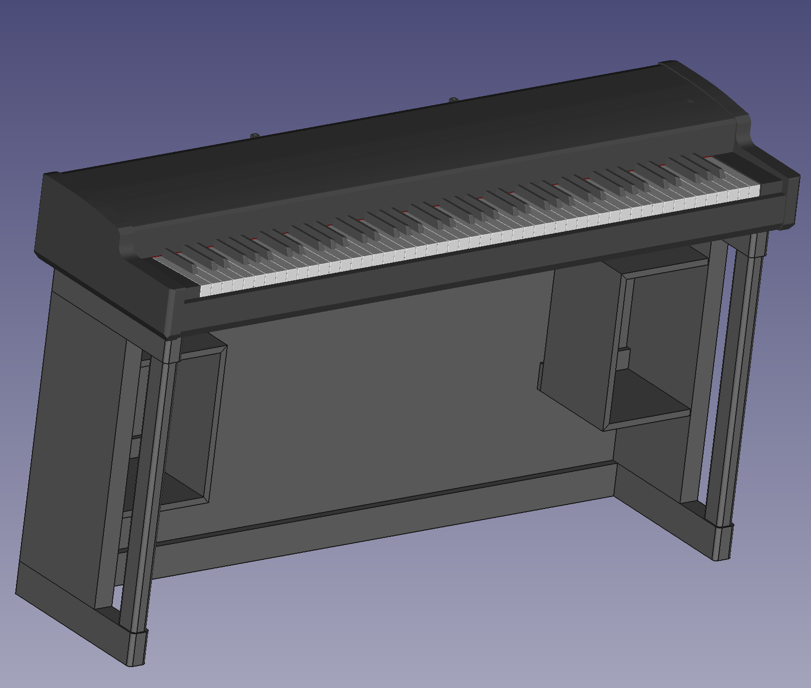

# A Kawai VPC1 Stand FreeCAD Model, Version 1.0

This is a stand model concept for the **Kawai VPC1 Midi Controller**. This was designed using the FreeCAD 3D Modeling tool version 0.20.

The VPC1 model was imported from the Sketchup version that can be found [here](https://3dwarehouse.sketchup.com/model.html?id=u2eb9abbd-6258-4b81-9b7b-794da64b6b98). I would like to tanks David-San from the PianoWorld forum for is work on this modeling of the VPC1.

The main file of the model is named `Assembly.FCStd` and depends on all parts that can be found in the other `.FCStd` files.

You are free to use this model for your own need. No waranty of any kind is supplied.

---

